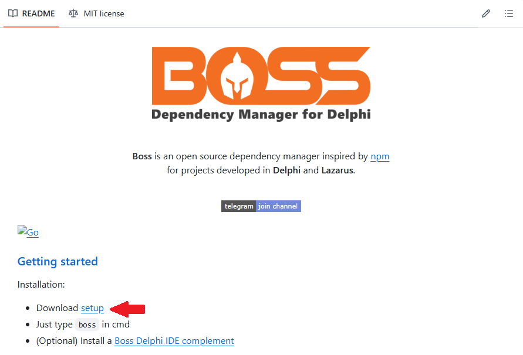

# Small Trainning Delphi

## 1 - Boas Vindas (1 Aulas)

#### 1.1 - Grupo de Alunos

## 2 - Orientação a Objetos, Fluent Interface e Padrões de Projeto (14 Aulas)

#### 2.1 - O que iremos ver no Small Trainning

#### 2.2 - Pensar na aplicação antes de escrever

#### 2.3 - Criando projeto de pedidos e promoção

  Criando um projeto e demonstrando a forma RAD de desenvolvimento com as implementações todas dentro do componente.

#### 2.4 - Usando Interface para trabalhar validações de regras

  Utilizando o projeto já criáo e refatorando a funcionalidade demonstrada no modo RAD, criando uma interface.
  
  Criação da Interface: Produto.Interfaces.pas
  
  Criação da Classe: Produto.pas

#### 2.5 - Eliminando casting na view

  Exemplicação do padrão de projeto Fluente.

  Programação funcional.

  Exemplo de polimorfismo com a reescrita do método para trabalhar o cast em strings.

  **IF** imutável, é o tipo em que se aplica a utilização de ifs.

#### 2.6 - Validando e dando foco no componente visual

  Desenvolvido um método com um esboço de como setar o focus em um componente após exception.

#### 2.7 - Centralizando regras fiscais com helpers

  Utilizando o: Helper

  O Helper permite que seja implementado funcionalidades a mais, dentro de componentes já existentes no Delphi. 
  
  Para o exemplo em questão o TComboBox.

  Adicionado comportamento no componente de acordo com o que for preenchido no Enum.

#### 2.8 - Utilizando eventos para exibir mensagem na tela

  Criando function utilizando TProc<>

  TProc<> é um método anônimo.

#### 2.9 - Especializando a classe de regras fiscais

  Especialização da classe Produto

  Criação das classes de impostos:
  SimplesNacional e LucroReal

  Criação de CodeTemplate. Para criação as explicações estão nesta aula. 

#### 2.10 - Especializando o Enumerado com as classes helpers

#### 2.11 - Compreendendo o objetivo da classe fechada para modificação e aberto para expanção

  Criação da classe de imposto:
  LucroPresumido

#### 2.12 - Implementando classe de gravação de log

  Reestruturação das pastas do projeto.

  Criação da pasta src, com suas sub-pastas **\Model**, **\Log**, **\Produto**

  Implementação da classe de interface de log: 
  
  Model.Log.Interfaces

  Model.Log.Texto

  Não será usado o Fluente para chamar o log e sim o **Decorator**

  Implementada a classe:

  Model.Log

#### 2.13 - Preparando a classe de log para expansão com o padrão decorator

  Modificando os Constructo, Destructor e class Function New.

  Inserindo no **private** uma variável para fazer uma injeção de dependência. Com o mesmo tipo da interface iLog.

  Refatoração para padrão com Decorator:

  Model.Log.pas
  
  ```
  private
    FDecorator : iLog;
  public
    constructor Create(Decorator : iLog = nil);
    class function New(Decorator : iLog = nil) : iLog;    
    class function TLog.New(Decorator : iLog = nil) : iLog;
  begin
    //Result := Self.Create;
    Result := Self.Create(Decorator);
  end;

  constructor TLog.Create(Decorator : iLog = nil);
  begin
    FDecorator := Decorator;
  end;

  function TLog.Gravar(aValue: String): iLog;
  begin
    //TLogTexto.New.Gravar(aValue);
    TLogTexto
      .New(
        TLogCsv.New
      ).Gravar(aValue);

  end;
  ```

#### 2.14 - Fontes do módulo

## 3 - MVC e Refatoração de Projetos (32 aulas)

#### 3.1 - Destravar é preciso

#### 3.2 - Overview do PDV totalmente RAD

#### 3.3 - Criando a camada view

  Primeiro passo da refatoração de um projeto RAD, é retirar a conexão do banco de um componente e criar a classe de conexão.

  Para monitorar possíveis despejos/vazamentos de memoria inserir um:
  
  ```
  ReporteMemoryLeakOnShutdown := True;  
  ```

  Segundo, cria as pastas para o MVC:

  \Model\Connection\Firedac
   
  \View\Forms

  \Controller


#### 3.4 - Entendendo a estrutura de um projeto com vida longa	

  Conforme boas práticas do clean code que seria trabalhar orientado a interface e não a uma classe.

  Explicações com diagrama(LucidChart) das conexões entre as camadas MVC.


#### 3.5 -  Implementando as conexões

  Firedac: Implementando a classe de conexão.

  Utilizando padrão de projeto singleton para a conexão.

#### 3.6 -  Como utilizar um ORM em sua aplicação

  Utilizando o SimpleORM para criação de JSON. Passo a passo de como add o SimpleORM do github e add no Delph.

  Criação das entidades pasta **\Entity** no projeto.

  SimpleORM transforma os objetos em SQL.

#### 3.7 -  Criando o DAO genérico

  Criando o DAO para o SQL.

  Explicação do funcionamento da Classe e da Interface.

#### 3.8 -  Considerações da classe DAO genérica

  Explicações de como implementar para os diversos modos de tecnologias, explicação panorâmica. Sem detalhes técnicos. Pegado a ideia do funcionamento.


#### 3.9 -  Entendendo como funciona os métodos do DAO

  Utilizar o SimpleORM que já possuir o DAO, que será re-utilizado.

  Criando uma conexaão buscando os dados a partir da conexão pela classe e trazendo os dados no grid.

#### 3.10 -  Implementando os métodos da classe DAO do SQL

**Implementando**:

    New
    Insert
    Update
    Delete
    Através do objeto.
    Métodos Find's por: Id, Por lista de objetos todos com (overload) sobrecarga do método find.
    Método Query
    Método DataSet
    Método LastId
    Método DataChange
    Métodos declarado mas implementação serão nas próximas aulas.

#### 3.11 -  Implementando o Controller de objeto genérico

#### 3.12 -  Criando o Controller que a view irá trabalhar

#### 3.13 -  Implementando as requisições da view ao controller

Overview do projeto até o momento.

Retirada de vários acomplamentos do form principal.

Explicações da conexão e como o projeto está organizado.

#### 3.14 -  Considerações das possíveis opções para o DAO

#### 3.15 -  O beneficio da organização da construção da tela


#### 3.16 -  Especializando o controllers do caixa

Especializando um módulo, no caso o caixa, implementando uma interface especializada com os métodos do caixa.

#### 3.17 -  Especializando o Model DAO para o mestre detalhe

#### 3.18 -  Recapitulando o que fizemos no Controllers e DAOs

#### 3.19 -  Implementando a Factory da camada View

Nesta etapa do curso o formulários que ficariam acoplados normalmente em uma unit menuprincipal por exemplo, passa se ser chamadas ou criadas a partrir de uma factory, esta será a responsável pela chamada e construção desses formulários. E o formulário principal terá com acomplamento mínimo que será somente junto a factory.

#### 3.20 -  Especializando o Controller Usuário da tela abrir caixa

Refatoração da tela de abertura de caixa.

Adicionado na iController Usuarios.

#### 3.21 -  Os prós de uma boa refatoração

#### 3.22 -  Refatorando o Insert da abertura do caixa

#### 3.23 -  Refatorando a tela de operador

#### 3.24 -  Ajustando o abrir caixa

#### 3.25 -  Criando a tela de seleção de cliente para abertua da venda

#### 3.26 -  Especializando o Controller Cliente da tela abrir venda

#### 3.27 -  Implemetando o Controller de Produto para a tela de venda itens

#### 3.28 -  Refatorando o quantidade da tela de venda itens

#### 3.29 -  Refatorando o adicionar itens da tela de venda itens

#### 3.30 -  Refatorando o remover itens da tela de venda itens

#### 3.31 -  Refatorando o finalizar venda da tela de venda itens

#### 3.32 -  Fontes do módulo

## 4 - MVC e Reutilização de Código em Servidore e Arquiteturas MultiCamadas

#### 4.1 - O que já vimos até arquivo

#### 4.2 - Preparando o ambiente para a criação do servidor de aplicação

Criando um projeto novo do tipo **console**, para este iremos criar com o nome de:

    AppServer

**Boss** : Gerenciador de pacotes para o Delphi. Tem a funcionalidade de fazer o download de arquivos do **github** instalar no Delphi, já inserindo esses componentes desses arquivos baixados no ***library path*** fazendo todo esse gerenciamento para o desenvolvedor.

**Instalando o Boss** Vá no link abaixo e faça o download:

[GuitHub para download do Boss](https://github.com/hashload/boss)

Logo mais abaixo da página do GuitHub encontrá 


<p align="center">
  
</p>


Revisar aula

baixar demais componentes
inserir detalhes dos passo a passo
inserir o link do 

horse
serializer
gbjason
Jhonson


..........

### Proxima aula...


---
---

## Atalhos Dephi

  **Ctrl + Shift + G** Gera assinatura de uma interface. Procedimento: ir logo abaixo de uma declaração de uma interface e pressionar o conjunto de teclas simultaneamente.

  **Ctrl + Shift + A** Importa de onde a Interface, Classe e etc... foi implementada para cláusula **uses**. Procedimento: selecione a palavra que deseja buscar, e pressione o conjunto de teclas simultaneamente.

  **Ctrl + Shift + C** Adiciona as implementações das  Functions ou Procedures com assinaturas declaradas. Procedimento: ir na linhas das declarações das function ou procedures e pressione o conjunto de teclas simultaneamente.

  **Ctrl + Shift + Alt + P** 
  Atualiza as modificação feitas na assinatura, replicando para as implementações das  Functions ou Procedures. Procedimento: ir na linha ou selecionar assinatura que teve modificação na sua declaração. Pressione o conjunto de teclas simultaneamente.

  **Alt + F11**  Abre interface para implementar o uso de um outro arquivo do projeto que ainda não esteja em uso no arquivo aberto.

  Formas de implementar:

  Interfaces ou Implementation

## Dicas

  Passar na criação/chamada de um formulário TForm o parametro Owner faz com que ao fechar o formulário principal, os demais sejam fechados juntos.

  Funciton AbrirForm(Owner : TForm) : Object

 


---
---
---